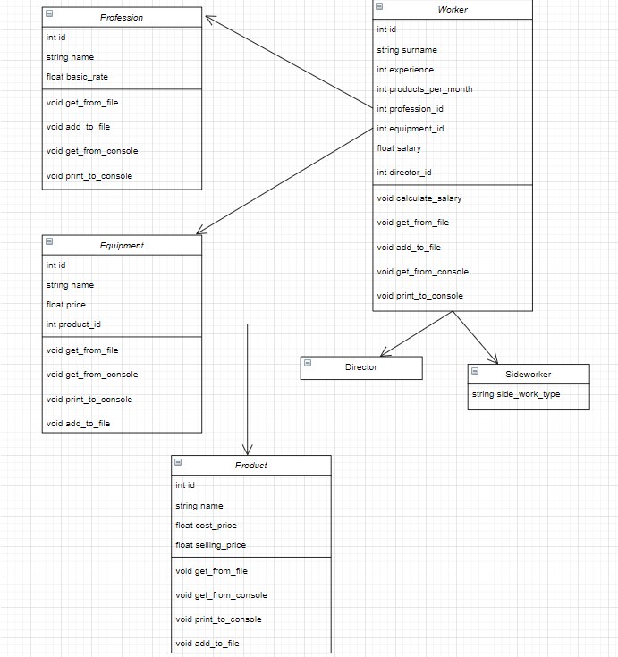

# Опис класів

## Клас “Виріб”:
Поля: id (унікальний номер кожного виробу), name(назва виробу), cost_price (собівартість), selling_price(звичайна ціна при продажу)
**Методи**:
-Три типи конструктора для: створення порожнього представника класу, для створення представника класу з усіма наданими полями, та конструктор копіювання
-Методи отримання/виведення з/у консоль.
-Методи отримання/запису з/у CSV файл(-у). Отримання з файлу представника класу здійнюється за допомогою надання унікального номеру продукту. Якщо в таблиці не було знайдено виріб з даним унікальним номером, користувач отримує повідомлення про це.
-Представники класу “Виріб” зберігаються у файлі “products.csv” у вигляді таблиці

## Клас “Професія”:
Поля: id (унікальний номер кожної професії), name(назва професії), basic_rate(базова ставка професії)
**Методи**:
-Три типи конструктора для: створення порожнього представника класу, для створення представника класу з усіма наданими полями, та конструктор копіювання
-Методи отримання/виведення з/у консоль.
-Методи отримання/запису з/у CSV файл(-у). Отримання з файлу представника класу здійнюється за допомогою надання унікального номеру професії. Якщо в таблиці не було знайдено професію з даним унікальним номером, користувач отримує повідомлення про це.
-Представники класу “Професія” зберігаються у файлі “professions.csv” у вигляді таблиці

## Клас “Обладнання”:
Поля: id (унікальний номер кожного обладнання), name(назва обладнання), price (ціна обладнання), product_id (унікальний номер виробу, який виготовляється за допомогою цього обладнання)
**Методи**:
-Три типи конструктора для: створення порожнього представника класу, для створення представника класу з усіма наданими полями, та конструктор копіювання
-Методи отримання/виведення з/у консоль.
-Методи отримання/запису з/у CSV файл(-у). Отримання з файлу представника класу здійнюється за допомогою надання унікального номеру обладнання. Якщо в таблиці не було знайдено обладнання з даним унікальним номером, користувач отримує повідомлення про це.
-Представники класу “Обладнання” зберігаються у файлі “equipments.csv” у вигляді таблиці

## Клас “Працівник”:
Поля: id (унікальний номер кожного працівника), surname (прізвище працівника), experience (стаж працівника у роках), products_per_month (кількість виготовленної продукції за місяць), equipment_id ( унікальний обладнання, яким користується працівник), profession_id ( унікальний номер професії даного працівника) , director_id (унікальний номер керівника даного працівника), salary (місячна заробтіна платня працівника)
**Методи**:
-Три типи конструктора для: створення порожнього представника класу, для створення представника класу з усіма наданими полями, та конструктор копіювання
-Методи отримання/виведення з/у консоль.
-Методи отримання/запису з/у CSV файл(-у). Отримання з файлу представника класу здійнюється за допомогою надання унікального номеру працівника. Якщо в таблиці не було знайдено працівника з даним унікальним номером, користувач отримує повідомлення про це.
-Метод обрахунку заробітної платні працівника, яка залежить від базової ставки професії, стажу, та видобутку ним продукції. Для обрахунку заробітної платні використовуємо формулу:
(1+experience/100)*(profession.basic_rate)+0.02*(products_per_month)*(product.selling_price-product.cost_price);
!Представники класу “Працівник” зберігаються у файлі “workers.csv” у вигляді таблиці

## Клас “Керівник”:
Поля: id (унікальний номер кожного працівника), surname (прізвище працівника), experience (стаж працівника у роках), products_per_month (кількість виготовленної продукції за місяць), equipment_id ( унікальний обладнання, яким користується працівник), profession_id ( унікальний номер професії даного працівника), salary (місячна заробтіна платня працівника)
**Методи**:
-Три типи конструктора для: створення порожнього представника класу, для створення представника класу з усіма наданими полями, та конструктор копіювання
-Методи отримання/виведення з/у консоль.
-Методи отримання/запису з/у CSV файл(-у). Отримання з файлу представника класу здійнюється за допомогою надання унікального номеру керівника. Якщо в таблиці не було знайдено керівника з даним унікальним номером, користувач отримує повідомлення про це.
-Метод обрахунку заробітної платні керівника, яка залежить від базової ставки професії та стажу. Для обрахунку заробітної платні використовуємо формулу:
(1+experience/5)*(profession.basic_rate)
-Представники класу “Керівник” зберігаються у файлі “directors.csv” у вигляді таблиці

## Клас “Сумісник”:
Поля: id (унікальний номер кожного працівника), surname (прізвище працівника), experience (стаж працівника у роках), products_per_month (кількість виготовленної продукції за місяць), equipment_id ( унікальний обладнання, яким користується працівник), profession_id ( унікальний номер професії даного працівника), salary (місячна заробтіна платня працівника), side_work_type( тип сумісницької праці)
**Методи**:
-Три типи конструктора для: створення порожнього представника класу, для створення представника класу з усіма наданими полями, та конструктор копіювання
-Методи отримання/виведення з/у консоль.
-Методи отримання/запису з/у CSV файл(-у). Отримання з файлу представника класу здійнюється за допомогою надання унікального номеру сумісника. Якщо в таблиці не було знайдено сумісника з даним унікальним номером, користувач отримує повідомлення про це.
-Метод обрахунку заробітної платні працівника, яка залежить від базової ставки професії, стажу, та видобутку ним продукції. Для обрахунку заробітної платні використовуємо формулу:
(1+experience/100)*(profession.basic_rate)+0.02*(products_per_month)*(product.selling_price-product.cost_price);
-Представники класу “Сумісник” зберігаються у файлі “sideworkers.csv” у вигляді таблиці

# Створені допоміжні функції
Для побудови вищеописаних класів, було створено функцію int set_id(string filename), яка приймає назву файлу з записами про певний клас, і повертає унікальний ключ представника класу. Ця функція потрібна при отриманні представника класу з консолі для подальшого запису у файл, а саме для автоматичного надання унікального номеру (як в базі даних, коли primary key при додаванні нового запису автоматично збільшується).
Головна задача: обчислення вартості обладнання праціників, що відносяться до даного керівника

# Опис вирішення
Для вирішення цієї задачі в файлі було описано функції, яка приймає представника класу як параметр. В функції ініціалізовано змінну float total_cost = 0.  Далі здійснюється пошук по всім працівника та сумісникам в файлах “workers.csv” та “sideworkers.csv” відповідно, де для кожного працівника перевіряється чи збігається унікальний номер їхнього керівника з унікальним номером наданого керівника. Якщо так, то ми отримуємо унікальний номер обладнання, яким користується даний працівник, та додаємо вартість цього обладнання до загальної вартості (total_cost+=equipment.price) обладнання працівників, що відносяться до заданого керівника.
В результаті виконання, функція повертає загальну вартість обладнання працівників, що відносяться до даного керівника.

## Нижче додано UML-діаграми описаних класів

 
